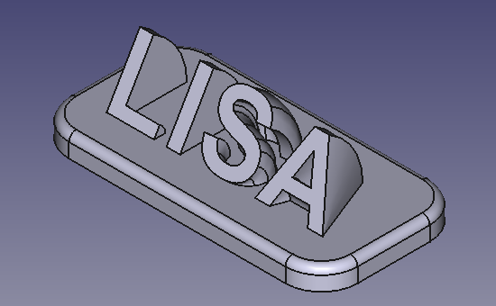

#  easyText
Python Workbench for Textshapes in FreeCAD

## Python Workbench for Textshapes 

Dies ist eine Python-Workbench für FreeCAD, die eine alternative Möglichkeit der Texterstellung testen soll, die für den Benutzer einfacher ist.

easyText lässt den vom User gewünschten Textstring von QT als QPainterPath generieren und generiert daraus dann FreeCAD-Wires (und ggfs. darauf aufbauende FreeCAD-Shapes). 

Durch diese Vorgehensweise kann die von Qt zur Verfügung gestellte Fontsverwaltung genutzt werden, bei der auf alle installierten Fonts des Betriebssystems zugegriffen werden kann, ohne den physischen Speicherort der TTF-Datei des Fonts zu kennen.

## Important Notes  
* Die Workbench ist experimentell und sollte nicht für ernsthafte Projekte benutzt werden.
  
## Installation
die heruntergeladene ZIP-Datei in das FreeCAD User Mod Verzeichnis entpacken. Nach dem nächsten Start von FreeCAD sollte "easyText" in der Liste der Workbenches auftauchen
  
## Features

### Features zur Texterstellung

####  easyTextString
easyTextString ist eine einfache Umsetzung der von QPainterPath gelieferten Linien in Wires. Dies ist die schnellere Methode und es können als Formatierung auch ein durchgestrichener Text und Unterstreichung bzw. Überstreichung benutzt werden. Die einzelnen Elemente des PainterPath werden als Compound zusammengefasst dargestellt. 
Die Auswahl von Text und Fonts können im Taskpanel erfolgen oder im Font-Dialog, siehe separater Punkt.

####  - easyTextGlyph
- der Text wird wieder als Compound dargestellt. Allerdings besteht das Compound aus Subshapes, die jeweils einem Buchstaben entsprechen und wieder aus einem oder auch mehreren Wires bestehen. Hierdurch können auch weitergehende Features auf Basis der einzelnen Buchstaben erstellt werden, beispielsweise easyTextAlongPath.
Die Auswahl von Text und Fonts können im Taskpanel erfolgen oder im Font-Dialog, siehe separater Punkt.

### Features zur Textdarstellung

####  - easyTextAlongPath
- besteht aus zwei Elementen: die Buchstaben eines easyTextGlyph laufen an einem FreeCAD-Wire entlang, in etwa so wie die Text-Along-Pfad Funktion von Inkscape.
Sind ein Wire und ein easyTextGlyph beim Aufruf der Funktion ausgewählt, werden diese übernommen, ansonsten können sie im TaskPanel ausgewählt werden.
Bei offenen Wires wird der Text immer in der Mitte des Wires zentriert, bei geschlossenen Wires kann der höchste bzw. niedrigste Punkt (jeweils Y-Richtung)

### Features für Text-Objekte

####  - easyTextRevolve
- erstellt ein Revolve aus einem easyTextGlyph. Mit der Option "makeBase" kann eine Basisplatte erzeugt werden und damit ein Namensschild erzeugt werden
- inspiriert durch https://www.youtube.com/watch?v=jdfLeTEE4P8

#### Text-und Font-Dialog
- zwei Ausrufmöglichkeiten für  den Text-und Font-Dialog 
-- vom Task-Panel aus über einen Button rechts neben dem Eingabefeld mit dem Fontnamen.
-- aus der Properties-List heraus durch die Auswahl neben der Property Font, ebenfalls mit 3 Punkten beschriftet

Im Dialog wird der Text angezeigt und kann neben der hekömmlichen Eingabe per Tastatur auch mit Unicode-Zeichen ergänzt werden, sofern diese vom Font (bzw durch Qt) unterstützt werden, hierfür gibt es wieder zwei Möglichkeiten
- wenn das Unicode-Zeichen bekannt ist, kann es einfach im Bereich "Insert Hex" eingetippt werden, nach Betätigung des Buttons "Insert Char" wird es an der aktuellen Einfügeposition in den bisherigen Text eingefügt. Wird beispielsweise der zu Testzwecken vorbesetzte Wert "00A9" mit "Insert Char" am Ende des Textes eingefügt wird, wird das Copyright-Zeichen eingefügt.
- alternativ kann die gesamte Unicode-Zeichentabelle durch den Button Glyph-Table als neues Fenster angezeigt werden.
Die Anzeige der Zeichen erfolgt hier als Beschriftung von Buttons mit dem jeweiligen Zeichen nach vorheriger Auswahl des Unicode-Blocks, nach Betätigung des Buttons wird das Zeichen gespeichert und unter "selected Text" oben rechts angezeigt. Nach ok wird das Fenster geschlossen und die Unicode-Zeichen wurden in der aktuellen Einfügeposition in den bisherigen Text eingefügt.

Außerdem können im Dialog für die Schriftart noch Formatierungen festgelegt werden, einmal Standard-Formatierungen über Button wie Fett (Button "B" wie Bold) oder Kursiv (Button "I" wie Italic) und darunter in einem ein- und ausblendbaren Bereich noch weitergehende Formatierungen)

Für den Dialog existiert ein Mini-Menü,über das man die Pointsize und die Buttonsize ändern kann. Ersteres verändert nur die Anzeige des Textes im Dialog selber und hat keinen Einfluss auf die Größe des als FreeCAD-Shape erzeugten Textes. Zweiteres verändert die Grösse der Buttons in der Unicode-Tabelle, Menschen mit guten Augen müssen etwas weniger scrollen.

## License
GNU Lesser General Public License v3.0
